# Cinder Architecture & Developer Guide

## What is Cinder?

Cinder is a lightweight, open-source backend framework for Python. It is designed to rapidly build production-ready REST APIs and realtime applications by automatically generating CRUD endpoints and Pub/Sub streams directly from Python data schemas.

It significantly reduces boilerplate by providing built-in features including JWT-based authentication, role-based access control (RBAC), advanced relationship expansion, dynamic sorting/filtering, pluggable multi-database support (SQLite · PostgreSQL · MySQL), pluggable file storage (local + S3-compatible), transactional email delivery, and seamless WebSockets/SSE integration for real-time state sync.

---

## High-Level Architecture Map

The following graph maps the entire repository, showcasing how the command-line interface, core application, routing, database integrations, storage, email, and realtime subsystems interact. This map is specifically designed to help developers and AI agents navigate the codebase and understand the file relationships.

```mermaid
graph TD
    %% Core Initialization Layer
    CLI["cinder/cli.py CLI Entrypoint"] -. "cinder serve" .-> APP["cinder/app.py App Builder"]

    %% Main Application Layer
    APP --> PIPE["cinder/pipeline.py ASGI App / Middleware"]
    PIPE -. "Yields Errors" .-> ERR["cinder/errors.py Exception Handling"]
    APP --> DB["cinder/db/connection.py Multi-DB Manager (shim)"]

    %% Hook System Layer
    APP --> HREG["cinder/hooks/registry.py Hook Storage"]
    HREG -. "Provides Hooks" .-> HRUN["cinder/hooks/runner.py Hook Executor"]
    HRUN --> HCTX["cinder/hooks/context.py Execution Context"]

    %% Dynamic Collections Layer (Data Schema and API)
    APP --> SCHEMA["cinder/collections/schema.py Collection + FileField Defs"]
    APP --> CROUTER["cinder/collections/router.py CRUD + File API Endpoints"]

    %% API Operations
    PIPE --> CROUTER
    CROUTER -. "Executes Hooks" .-> HRUN
    CROUTER --> STORE["cinder/collections/store.py Query Builder & Executor"]
    SCHEMA -. "Validates Data" .-> STORE
    STORE --> DB
    DB --> DB_BE["cinder/db/backends/ DatabaseBackend ABC + SQLite/PG/MySQL"]

    %% File Storage Subsystem (Phase 4)
    APP --> STORAGE["cinder/storage/ File Storage Subsystem"]
    STORAGE --> STOR_BE["cinder/storage/backends.py FileStorageBackend ABC + LocalFileBackend"]
    STORAGE --> STOR_S3["cinder/storage/s3.py S3CompatibleBackend + 7 provider presets"]
    STORAGE --> STOR_KEYS["cinder/storage/keys.py Key Generation & Filename Sanitization"]
    STORAGE --> STOR_ROUTES["cinder/storage/routes.py Upload / Download / Delete Handlers"]
    STORAGE --> STOR_CLEAN["cinder/storage/cleanup.py Orphan File Cleanup (after_delete hooks)"]
    CROUTER -. "Mounts file routes" .-> STOR_ROUTES
    STOR_ROUTES --> STOR_BE
    STOR_CLEAN -. "registers after_delete hooks" .-> HREG

    %% Email Subsystem (Phase 5)
    APP --> EMAIL["cinder/email/ Email Subsystem"]
    EMAIL --> EMAIL_BE["cinder/email/backends.py EmailBackend ABC + ConsoleEmailBackend"]
    EMAIL --> EMAIL_SMTP["cinder/email/smtp.py SMTPBackend + 7 provider presets"]
    EMAIL --> EMAIL_TPL["cinder/email/templates.py Built-in HTML/text email templates"]
    APP -. "app.email facade" .-> EMAIL_BE
    APP -. "app.email facade" .-> EMAIL_SMTP

    %% Authentication Layer
    APP --> AUTH_MOD["cinder/auth/models.py User Schema + Email Verification Tokens"]
    APP --> AROUTER["cinder/auth/routes.py Login / Register / Verify-Email APIs"]

    PIPE --> AROUTER
    AROUTER --> TOKENS["cinder/auth/tokens.py JWT Encode/Decode"]
    AROUTER --> PASS["cinder/auth/passwords.py Hashing"]
    AROUTER --> DB
    AROUTER -. "dispatches emails" .-> EMAIL

    %% Realtime Subsystem
    APP --> R_BROKER["cinder/realtime/broker.py Pub/Sub Broker"]
    PIPE --> R_WS["cinder/realtime/websocket.py WebSocket Handler"]
    PIPE --> R_SSE["cinder/realtime/sse.py SSE Handler"]

    R_WS --> R_BROKER
    R_SSE --> R_BROKER

    R_WS -. "Validates Token" .-> R_AUTH["cinder/realtime/auth.py RT Auth Helpers"]
    R_SSE -. "Validates Token" .-> R_AUTH
    R_AUTH -. "Decodes" .-> TOKENS

    R_BROKER --> R_FILTER["cinder/realtime/auth_filter.py RT RBAC Filtering"]

    %% The Bridge between Collections and Realtime
    APP --> R_BRIDGE["cinder/realtime/bridge.py Collections to Broker Bridge"]
    CROUTER -. "Triggers Events" .-> R_BRIDGE
    R_BRIDGE --> R_BROKER

    %% Redis Broker
    R_REDIS["cinder/realtime/redis_broker.py Redis Pub/Sub Broker"] -. "implements BrokerProtocol" .-> R_BROKER

    %% Shared Redis Client
    REDIS_CLIENT["cinder/cache/redis_client.py Shared Redis Client"]

    %% Cache Subsystem (Phase 8)
    APP --> CACHE_CFG["cinder/cache/ Cache Subsystem"]
    CACHE_CFG --> CACHE_BE["cinder/cache/backends.py CacheBackend ABC + Implementations"]
    CACHE_CFG --> CACHE_MW["cinder/cache/middleware.py CacheMiddleware (cache-aside)"]
    CACHE_CFG --> CACHE_INV["cinder/cache/invalidation.py Tag-based Invalidation"]
    CACHE_BE --> REDIS_CLIENT
    R_REDIS --> REDIS_CLIENT

    %% Rate-Limit Subsystem (Phase 8)
    APP --> RL_CFG["cinder/ratelimit/ Rate-Limit Subsystem"]
    RL_CFG --> RL_BE["cinder/ratelimit/backends.py RateLimitBackend ABC + Implementations"]
    RL_CFG --> RL_MW["cinder/ratelimit/middleware.py RateLimitMiddleware"]
    RL_BE --> REDIS_CLIENT

    %% Pipeline wiring
    PIPE --> CACHE_MW
    PIPE --> RL_MW

    %% Invalidation hooks into the hook system
    CACHE_INV -. "registers after_* hooks" .-> HREG

    %% Migrations Subsystem (Feature 3)
    CLI -. "cinder migrate / doctor / routes / info / generate-secret" .-> MIG["cinder/migrations/ Migration Engine"]
    MIG --> MIG_ENG["cinder/migrations/engine.py MigrationEngine + _schema_migrations"]
    MIG --> MIG_DIFF["cinder/migrations/diff.py SchemaComparator (AddTable/AddColumn/DropColumn)"]
    MIG --> MIG_GEN["cinder/migrations/generator.py Migration File Generator"]
    MIG_ENG --> DB
    MIG_DIFF --> DB
    MIG_DIFF --> SCHEMA
```



---

## Detailed Subsystem Breakdown and File Manifest

### 1. The Application Core (`src/cinder/`)

* **`app.py`** — Defines the `Cinder` class. Central registry where developers register schemas, configure auth, email, storage, database, caching, and rate-limiting, and initialize the realtime broker. Exposes five fluent configuration entry-points:
  - `app.cache` → `_CacheConfig` — cache backend, TTL, per-user segmentation, excluded paths.
  - `app.rate_limit` → `_RateLimitConfig` — backend, global defaults, per-route rules.
  - `app.email` → `_EmailConfig` — SMTP backend, sender address, app name, base URL, template overrides for password-reset / verification / welcome emails. Dispatches via `asyncio.create_task` (non-blocking).
  - `app.configure_storage(backend)` — sets the `FileStorageBackend` used by all `FileField` columns. Validated at `build()` time.
  - `app.configure_database(backend)` — plugs in a fully pre-configured `DatabaseBackend`. Takes highest precedence over env vars and the `database=` constructor arg. Useful for custom pool settings, SSL, or bring-your-own-driver scenarios.
* **`pipeline.py`** — Formats HTTP and WebSocket requests. Manages CORS, standardises error shapes, assigns request IDs, and decides whether a request routes to Auth, Collections, or Realtime endpoints.
* **`cli.py`** — Handles terminal commands (via Typer). Commands: `serve`, `init`, `promote`, `generate-secret`, `doctor`, `routes`, `info`, and the `migrate` sub-app (`run`, `status`, `rollback`, `create`). See [Migrations Subsystem](#11-migrations-subsystem-srccindermigrations) below.
* **`errors.py`** — A unified set of exceptions allowing standard error responses across all modules.

### 2. The Database Layer (`src/cinder/db/`)

Cinder's database layer is fully pluggable, mirroring the same backend-ABC pattern used by storage, email, cache, and rate-limit subsystems. All callers write SQL using `?` as the universal placeholder; each backend converts it internally to the native style.

* **`connection.py`** — Thin shim (`Database` class) that delegates all operations to the active `DatabaseBackend`. Constructor accepts a bare path, a `sqlite:///` URL, `postgresql://`, or `mysql://`. Two additional methods beyond the original five: `table_exists(name)` and `get_columns(name)` — used by `store.py` for database-agnostic schema introspection. Environment variables override the programmatic URL: `CINDER_DATABASE_URL` (highest) → `DATABASE_URL` (standard PaaS) → constructor arg → `"app.db"` (default SQLite).

* **`backends/base.py`** — `DatabaseBackend` ABC defines the seven-method contract all backends must satisfy: `connect`, `disconnect`, `execute`, `fetch_one`, `fetch_all`, `table_exists`, `get_columns`. `DatabaseIntegrityError` — a driver-agnostic exception raised by all backends on UNIQUE / NOT NULL constraint violations; replaces `sqlite3.IntegrityError` throughout the codebase so callers never import driver-specific types.

* **`backends/sqlite.py`** — `SQLiteBackend`. Extracts the original `aiosqlite` logic. WAL mode, foreign-key enforcement, lazy auto-connect. `table_exists` uses `sqlite_master`; `get_columns` uses `PRAGMA table_info`. Wraps `IntegrityError` (detected by class name, for aiosqlite portability) as `DatabaseIntegrityError`.

* **`backends/postgresql.py`** — `PostgreSQLBackend`. Uses `asyncpg` (optional extra: `cinder[postgres]`). Creates an `asyncpg.create_pool` with configurable `min_size` / `max_size` / `max_inactive_connection_lifetime` (default 300 s — prevents stale connections on NeonDB/Supabase serverless). Converts `?` → `$1, $2, ...`. `table_exists` / `get_columns` query `information_schema`. Catches `asyncpg.UniqueViolationError` and `asyncpg.IntegrityConstraintViolationError` → `DatabaseIntegrityError`. Retries transient connection errors once. Pool size configurable via `CINDER_DB_POOL_MIN/MAX/TIMEOUT/CONNECT_TIMEOUT` env vars.

* **`backends/mysql.py`** — `MySQLBackend`. Uses `aiomysql` (optional extra: `cinder[mysql]`). Creates `aiomysql.create_pool` with `DictCursor` and `autocommit=True`. Converts `?` → `%s`. Rewrites `TEXT PRIMARY KEY` → `VARCHAR(36) PRIMARY KEY` inside `CREATE TABLE` DDL (MySQL requires a length prefix for TEXT primary keys; all Cinder primary keys are 36-char UUID strings). Accepts `mysql://`, `mysql+aiomysql://`, and `mysql+asyncmy://` URL schemes. Catches `aiomysql.IntegrityError` → `DatabaseIntegrityError`.

* **`backends/__init__.py`** — `resolve_backend(url)` factory. Reads env vars first (`CINDER_DATABASE_URL` → `DATABASE_URL`), then falls back to the programmatic URL. Dispatches on URL prefix: `postgresql://` / `postgres://` → `PostgreSQLBackend`; `mysql://` / `mysql+*://` → `MySQLBackend`; anything else → `SQLiteBackend`. Drivers are imported lazily — SQLite-only users never need asyncpg or aiomysql installed.

### 3. Dynamic Collections & API Generation (`src/cinder/collections/`)

* **`schema.py`** — Contains `Collection` and all field definitions. Built-in field types:
  - `TextField`, `IntField` (min/max), `FloatField` (min/max), `BoolField`, `DateTimeField` (auto_now), `URLField`, `JSONField`, `RelationField`
  - **`FileField`** *(Phase 4)* — stores file metadata as JSON in a SQLite TEXT column; actual bytes live in the configured `FileStorageBackend`. Parameters: `max_size`, `allowed_types` (MIME wildcards), `multiple`, `public`.
* **`router.py`** — Generates CRUD REST endpoints (`GET`, `POST`, `PATCH`, `DELETE`). Connects requests, extracts query filters/pagination, enforces RBAC, triggers hooks. Additionally mounts three file endpoints for every `FileField` on a collection: `POST/GET/DELETE /api/{collection}/{id}/files/{field}`.
* **`store.py`** — SQL query building engine. Handles serialisation/deserialisation of `BoolField`, `JSONField`, and `FileField` values. Uses `db.table_exists()` and `db.get_columns()` for schema introspection (database-agnostic — no SQLite-specific queries). Catches `DatabaseIntegrityError` (UNIQUE / NOT NULL constraint violations from any backend) and converts them to `CinderError(400, ...)` so callers always receive a clean 400 instead of an unhandled 500.

### 4. Lifecycle Hooks (`src/cinder/hooks/`)

* **`registry.py`** — Centralised repository storing developer-registered hook functions, keyed by event string.
* **`runner.py`** — Invokes registered hooks in registration order during the lifecycle of an HTTP request. Supports sync and async handlers transparently.
* **`context.py`** — Defines `CinderContext`, injected into every hook, carrying `user`, `request_id`, `collection`, `operation`, `request`, and `extra`.

### 5. Authentication System (`src/cinder/auth/`)

* **`models.py`** — Configures the built-in `_users` table, allows developers to extend it with custom fields. Creates and owns:
  - `_token_blocklist` — revoked JWT tokens (auto-cleaned on startup). `block_token()` uses a try/except on `DatabaseIntegrityError` instead of `INSERT OR IGNORE` — portable across all backends.
  - `_email_verifications` — one-time 24-hour verification tokens. `create_verification_token(db, user_id, email)` deletes any prior token for the user before inserting the new one (re-send invalidation). `cleanup_expired_verifications(db)` is called on startup.
* **`routes.py`** — Standardised endpoints for user registration, login, logout, token refresh, forgot-password, reset-password, and **email verification** (`GET /api/auth/verify-email?token=<token>`). When `email_config` is injected:
  - Registration → dispatches verification email.
  - Forgot-password → dispatches password-reset email.
  - Without `email_config` → falls back to logging the token to the console (zero breaking change).
* **`passwords.py`** — Securely hashes and verifies user passwords.
* **`tokens.py`** — Signs and verifies JSON Web Tokens for stateless session handling.

### 6. File Storage Subsystem (`src/cinder/storage/`) *(Phase 4)*

* **`backends.py`** — `FileStorageBackend` ABC defines the contract every backend must implement: `put`, `get`, `delete`, `signed_url`, `url`. `LocalFileBackend` stores files on disk, always proxied (no signing). Path-traversal is prevented with `Path.resolve()`.
* **`s3.py`** — `S3CompatibleBackend` — wraps boto3 in `asyncio.get_event_loop().run_in_executor` for async safety. Ships with seven provider preset classmethods: `.aws()`, `.r2()`, `.minio()`, `.backblaze()`, `.digitalocean()`, `.wasabi()`, `.gcs()`. All use the same underlying S3 wire protocol; only `endpoint_url` and `region_name` differ. Presigned URLs are generated fresh per request and never stored.
* **`keys.py`** — Key generation and filename sanitisation. Format: `{collection}/{record_id}/{field}/{uuid}_{sanitized_name}`. `sanitize_filename()` strips path traversal characters and replaces special chars with underscores, preserving the last file extension only.
* **`routes.py`** — Three handler factories mounted by `router.py` for each `FileField`:
  - **Upload** — validates auth, streams the body with a byte counter (rejects mid-stream on `max_size` exceeded), validates MIME type via both `Content-Type` header and magic bytes (first 512 bytes), generates a UUID-prefixed storage key, calls `backend.put()`, updates the SQLite JSON metadata column.
  - **Download** — respects `field.public` (auth bypass). For remote backends, redirects to a presigned URL (302); for local backend, proxies bytes. When `field.public=False` on a public-read collection, minimum auth rule is elevated to `authenticated`.
  - **Delete** — supports `?index=N` (remove one file from a `multiple` field) and `?all=true` (remove all). Calls `backend.delete()` and updates metadata.
* **`cleanup.py`** — `install_file_cleanup(registry, backend, collections)` — installs `after_delete` hooks on all collections with FileFields. On record deletion, iterates stored metadata and calls `backend.delete(key)` for each file. Failures are logged and swallowed — background cleanup never raises.

### 7. Email Subsystem (`src/cinder/email/`) *(Phase 5)*

* **`backends.py`** — `EmailMessage` dataclass (`to`, `subject`, `html_body`, `text_body`, `from_address`). `EmailBackend` ABC with a single abstract method `send(message)`. `ConsoleEmailBackend` — zero-dependency development fallback that logs email content to the server log; used automatically when no backend is configured.
* **`smtp.py`** — `SMTPBackend` — async SMTP delivery via `aiosmtplib` (lazy import; raises `ImportError` with install instructions if missing). Builds `multipart/alternative` MIME messages (plain text first, HTML second per RFC 2046). Retry logic classifies errors as **permanent** (`SMTPAuthenticationError`, `SMTPRecipientsRefused`, `SMTPSenderRefused` — re-raised immediately) or **transient** (exponential back-off with `asyncio.sleep`). Ships with seven provider preset classmethods: `.gmail()`, `.sendgrid()`, `.ses()`, `.mailgun()`, `.mailtrap()`, `.postmark()`, `.resend()`. All presets use STARTTLS on port 587 except Resend (implicit TLS, port 465).
* **`templates.py`** — Three built-in inline-styled HTML/text template functions, each returning `(subject, html_body, text_body)`:
  - `password_reset_email(reset_url, app_name, expiry_minutes)`
  - `email_verification_email(verify_url, app_name)`
  - `welcome_email(user_email, app_name)`
  No CDN, no external dependencies. Templates are overridable via `app.email.on_password_reset(fn)` / `.on_verification(fn)` / `.on_welcome(fn)` — any callable returning `(subject, html, text)` is accepted, supporting Jinja2, f-strings, Mako, or any other engine.

### 8. Cache Subsystem (`src/cinder/cache/`)

* **`redis_client.py`** — Shared lazy async Redis client singleton. Created once on first use and reused across cache, rate-limit, and realtime broker subsystems. Closed during `app:shutdown`.
* **`backends.py`** — `CacheBackend` ABC with two built-in implementations: `MemoryCacheBackend` (dict + asyncio timers, zero-dependency) and `RedisCacheBackend` (Redis-backed, multi-process safe). Custom backends subclass `CacheBackend`.
* **`middleware.py`** — `CacheMiddleware` implements the cache-aside pattern for collection GET requests. Per-user key segmentation prevents RBAC leaks. Adds `X-Cache: HIT/MISS` headers. Fail-open on backend errors.
* **`invalidation.py`** — Installs `after_create/update/delete` hooks on every collection to automatically bust cached responses using tag-based key grouping.

### 9. Rate-Limit Subsystem (`src/cinder/ratelimit/`)

* **`backends.py`** — `RateLimitBackend` ABC with `MemoryRateLimitBackend` (sliding-window deque) and `RedisRateLimitBackend` (atomic Lua script token bucket, race-condition safe across workers).
* **`middleware.py`** — `RateLimitMiddleware` returns `429 Too Many Requests` with `Retry-After`, `X-RateLimit-Limit/Remaining/Reset` headers. Supports global defaults and per-route `RateLimitRule` overrides. Fail-open on backend errors.

### 10. Realtime Subsystem (`src/cinder/realtime/`)

* **`broker.py`** — Defines `BrokerProtocol` (a `typing.Protocol`) and `RealtimeBroker` — the default in-process fan-out pub/sub. The protocol ensures custom brokers are type-checkable drop-ins.
* **`redis_broker.py`** — `RedisBroker` — a `BrokerProtocol`-satisfying Redis pub/sub implementation. Activated via `CINDER_REALTIME_BROKER=redis` or `app.configure_redis(url=...)`. RBAC filtering is applied locally after receiving from Redis.
* **`websocket.py`** — Provides bi-directional realtime communication, managing the WebSocket ASGI lifecycle, ping/pong heartbeats, and client subscriptions.
* **`sse.py`** — Provides Server-Sent Events via an HTTP stream for read-only, robust unidirectional real-time updates.
* **`bridge.py`** — The connector between CRUD components and the realtime stream. Hooks into database mutations and broadcasts events to the broker.
* **`auth.py`** — Utilities for authenticating realtime connections dynamically.
* **`auth_filter.py`** — Applies RBAC filtering during broadcast, preventing clients from receiving data they shouldn't see.

### 11. Migrations Subsystem (`src/cinder/migrations/`)

CLI-driven, explicit schema migration system that coexists with the existing `sync_schema()` auto-sync. Auto-sync continues to handle additive changes (new tables, new columns) on every startup. Migration files handle version-tracked, complex operations that auto-sync cannot: indexes, data transforms, column drops, renames, and any change requiring an audit trail.

* **`engine.py`** — `MigrationFile` NamedTuple (`id`, `path`) and `MigrationEngine` class:
  - `discover()` — globs `migrations/*.py`, sorted by filename (timestamp prefix guarantees chronological order).
  - `ensure_table()` — creates `_schema_migrations (id TEXT PRIMARY KEY, applied_at TEXT NOT NULL)` if absent.
  - `get_applied()` / `get_pending()` — set operations between discovered files and DB records.
  - `apply(migration)` — loads the module via `importlib`, validates `up` callable exists, calls `await mod.up(db)`, records the migration with UTC ISO timestamp. Wraps errors with migration ID in the message.
  - `rollback()` — queries `_schema_migrations ORDER BY applied_at DESC` to find the most-recently-applied migration, calls `await mod.down(db)`, deletes the record. Warns (via `logging`) and removes orphaned records when a migration file has been deleted post-apply.
  - `run_pending()` / `status()` — batch apply and full status report (including `"orphaned"` entries for applied-but-deleted files).

* **`diff.py`** — `SchemaComparator` for auto-generating migration content from live schema state. Compares each registered `Collection`'s field definitions against `db.get_columns()` and produces: `AddTable(collection)`, `AddColumn(table, field_name, col_sql)`, `DropColumn(table, col_name, destructive=True)`. Built-in columns (`id`, `created_at`, `updated_at`) are excluded from the diff.

* **`generator.py`** — Pure functions for producing migration file content: `generate_migration_id(name)` (timestamp-prefixed slug), `generate_migration_content(operations, name)` (renders `async def up(db)` / `async def down(db)` Python source; destructive `DropColumn` ops are commented out by default), `write_migration_file(migrations_dir, name, content)` (creates the directory if absent, writes the file, returns its `Path`).

* **`__init__.py`** — Exports `MigrationEngine`, `MigrationFile`, `SchemaComparator`, `AddTable`, `AddColumn`, `DropColumn`, `generate_migration_content`, `generate_migration_id`, `write_migration_file`.

Migration files follow the pattern:
```python
# migrations/20260409_143022_add_index_posts_category.py
"""Add index on posts.category"""

async def up(db):
    await db.execute("CREATE INDEX idx_posts_category ON posts (category)")

async def down(db):
    await db.execute("DROP INDEX IF EXISTS idx_posts_category")
```

---

## Test Suite Overview

The test suite lives in `tests/` and is run with `pytest`. All async tests use `pytest-asyncio`.

### Coverage by area

| Area | Key test files |
|------|---------------|
| Schema / field definitions | `test_schema.py` |
| Collection CRUD (HTTP) | `test_router.py`, `test_integration.py` |
| Store layer | `test_store.py` |
| Authentication | `test_auth.py`, `test_auth_core.py`, `test_auth_middleware.py` |
| Email backends & templates | `test_email_backends.py`, `test_email_templates.py` |
| Email verification flow | `test_email_verification.py` |
| File storage | `test_storage_backends.py`, `test_storage_routes.py`, `test_storage_keys.py` |
| Hooks & lifecycle | `test_hooks.py` |
| Database layer & backends | `test_db.py` |
| Migrations (engine, diff, generator) | `test_migrations.py`, `test_migration_diff.py`, `test_migration_generator.py` |
| Cache backends | `test_cache_backends.py` |
| Cache invalidation | `test_cache_invalidation.py` |
| Rate limiting | `test_ratelimit.py` |
| Realtime (WebSocket/SSE) | `test_realtime.py` |
| Redis broker | `test_redis_broker.py` |
| App-level integration | `test_app.py` |

### Test quality standards enforced

- **No duplicate fixtures** — `TestRedisCacheBackend` previously had two `backend` fixtures; the unreachable first one was removed; the `patch_redis` autouse fixture handles all Redis monkeypatching.
- **`@pytest.mark.asyncio` on all module-level async tests** — `test_cache_invalidation.py` and `test_redis_broker.py` now carry explicit markers on every async function so pytest-asyncio handles them correctly.
- **No private attribute traversal** — `test_hooks.py`'s `test_app_error_hook_fires_on_unhandled_exception` previously accessed `built._inner` and walked `.app` chains to inject a route. It now uses the public API: registers a collection with a `before_create` hook that raises `RuntimeError`, then POSTs to trigger it.
- **Edge-case coverage**:
  - `FloatField` — `min_value`/`max_value` attribute assertions and full Pydantic validation (over/under boundary, required-field rejection) in `test_schema.py`.
  - Multi-field expand (`?expand=a,b`) and expand on list endpoints in `test_router.py::TestExpand`.
  - Invalid expand field (non-relation field) — verifies no crash, graceful 200.
  - UNIQUE constraint violations — `TestUniqueConstraints` covers both `POST` (duplicate create) and `PATCH` (update to conflicting value) returning 400, backed by the `DatabaseIntegrityError` → `CinderError(400)` conversion in `store.py` (driver-agnostic, works across SQLite, PostgreSQL, and MySQL).
  - Database backend dispatch — `test_db.py` covers `table_exists`, `get_columns`, `resolve_backend` URL dispatch for all three drivers, env-var priority chain (`CINDER_DATABASE_URL` > `DATABASE_URL` > programmatic), and `DatabaseIntegrityError` surfacing through the `Database` shim.
  - Multiple required fields missing — `TestFieldConstraintsAtHTTPLayer` covers partial and fully missing required fields, `IntField` min constraint, and `FloatField` max constraint at the HTTP layer.

---

## Important Architectural Principles

1. **Code-as-Schema** — Python classes completely define the data state. There are no standalone migration files; the schema definition *is* the migration. `FileField` extends this to binary assets.
2. **Zero Boilerplate APIs** — Defining a `Collection` generates CRUD endpoints automatically. Adding a `FileField` also generates upload/download/delete endpoints. Time is spent defining models, permissions, and hooks.
3. **Pluggable Everything** — Every subsystem that touches external infrastructure has an ABC and ships with concrete implementations and provider presets. Database backends (SQLite / PostgreSQL / MySQL / custom), storage backends, email backends, cache backends, rate-limit backends, and realtime brokers are all swappable with a single `app.configure_*(...)` or `app.*.use(...)` call.
4. **Non-Blocking by Default** — Email dispatch uses `asyncio.create_task`; storage operations on remote backends run in thread executors; cache and rate-limit failures are fail-open. No user-facing request is blocked by infrastructure.
5. **Reactive by Default** — Hooking the Collections pipeline to the Realtime Broker via the Bridge means any mutation on a Collection accurately emits an event to subscribed frontend clients.
6. **Minimal Dependency Footprint** — Core Cinder uses standard libraries, SQLite, and an ASGI server. S3 support (`boto3`), email delivery (`aiosmtplib`), Redis (`redis`), PostgreSQL (`asyncpg`), and MySQL (`aiomysql`) are all optional extras that are lazily imported with clear `ImportError` messages. SQLite-only users never need any database driver installed beyond the built-in `aiosqlite`.
