# Cinder Architecture & Developer Guide

## What is Cinder?

Cinder is a lightweight, open-source backend framework for Python. It is designed to rapidly build production-ready REST APIs and Realtime applications by automatically generating CRUD endpoints and Pub/Sub streams directly from Python data schemas.

It significantly reduces boilerplate by providing built-in features including JWT-based authentication, role-based access control (RBAC), advanced relationship expansion, dynamic sorting/filtering, automatic SQLite database provisioning, and seamless WebSockets/SSE integration for real-time state sync.

---

## High-Level Architecture Map

The following graph maps the entire repository, showcasing how the command-line interface, core application, routing, database integrations, and realtime subsystems interact. This map is specifically designed to help developers and AI agents navigate the codebase and understand the file relationships.

```mermaid
graph TD
    %% Core Initialization Layer
    CLI["cinder/cli.py CLI Entrypoint"] -. "cinder serve" .-> APP["cinder/app.py App Builder"]
    
    %% Main Application Layer
    APP --> PIPE["cinder/pipeline.py ASGI App / Middleware"]
    PIPE -. "Yields Errors" .-> ERR["cinder/errors.py Exception Handling"]
    APP --> DB["cinder/db/connection.py SQLite DB Manager"]

    %% Hook System Layer
    APP --> HREG["cinder/hooks/registry.py Hook Storage"]
    HREG -. "Provides Hooks" .-> HRUN["cinder/hooks/runner.py Hook Executor"]
    HRUN --> HCTX["cinder/hooks/context.py Execution Context"]

    %% Dynamic Collections Layer (Data Schema and API)
    APP --> SCHEMA["cinder/collections/schema.py Collection Defs"]
    APP --> CROUTER["cinder/collections/router.py CRUD API Endpoints"]
    
    %% API Operations
    PIPE --> CROUTER
    CROUTER -. "Executes Hooks" .-> HRUN
    CROUTER --> STORE["cinder/collections/store.py Query Builder & Executor"]
    SCHEMA -. "Validates Data" .-> STORE
    STORE --> DB

    %% Authentication Layer
    APP --> AUTH_MOD["cinder/auth/models.py User Settings & Extending"]
    APP --> AROUTER["cinder/auth/routes.py Login/Register APIs"]
    
    PIPE --> AROUTER
    AROUTER --> TOKENS["cinder/auth/tokens.py JWT Encode/Decode"]
    AROUTER --> PASS["cinder/auth/passwords.py Hashing"]
    AROUTER --> DB

    %% Realtime Subsystem
    APP --> R_BROKER["cinder/realtime/broker.py Pub/Sub Broker"]
    PIPE --> R_WS["cinder/realtime/websocket.py WebSocket Handler"]
    PIPE --> R_SSE["cinder/realtime/sse.py SSE Handler"]
    
    R_WS --> R_BROKER
    R_SSE --> R_BROKER
    
    R_WS -. "Validates Token" .-> R_AUTH["cinder/realtime/auth.py RT Auth Helpers"]
    R_SSE -. "Validates Token" .-> R_AUTH
    R_AUTH -. "Decodes" .-> TOKENS
    
    R_BROKER --> R_FILTER["cinder/realtime/auth_filter.py RT RBAC Filtering"]
    
    %% The Bridge between Collections and Realtime
    APP --> R_BRIDGE["cinder/realtime/bridge.py Collections to Broker Bridge"]
    CROUTER -. "Triggers Events" .-> R_BRIDGE
    R_BRIDGE --> R_BROKER

    %% Redis Broker (Phase 6.5 / Phase 8)
    R_REDIS["cinder/realtime/redis_broker.py Redis Pub/Sub Broker"] -. "implements BrokerProtocol" .-> R_BROKER

    %% Shared Redis Client
    REDIS_CLIENT["cinder/cache/redis_client.py Shared Redis Client"]

    %% Cache Subsystem (Phase 8)
    APP --> CACHE_CFG["cinder/cache/ Cache Subsystem"]
    CACHE_CFG --> CACHE_BE["cinder/cache/backends.py CacheBackend ABC + Implementations"]
    CACHE_CFG --> CACHE_MW["cinder/cache/middleware.py CacheMiddleware (cache-aside)"]
    CACHE_CFG --> CACHE_INV["cinder/cache/invalidation.py Tag-based Invalidation"]
    CACHE_BE --> REDIS_CLIENT
    R_REDIS --> REDIS_CLIENT

    %% Rate-Limit Subsystem (Phase 8)
    APP --> RL_CFG["cinder/ratelimit/ Rate-Limit Subsystem"]
    RL_CFG --> RL_BE["cinder/ratelimit/backends.py RateLimitBackend ABC + Implementations"]
    RL_CFG --> RL_MW["cinder/ratelimit/middleware.py RateLimitMiddleware"]
    RL_BE --> REDIS_CLIENT

    %% Pipeline wiring
    PIPE --> CACHE_MW
    PIPE --> RL_MW

    %% Invalidation hooks into the hook system
    CACHE_INV -. "registers after_* hooks" .-> HREG
```

---

## Detailed Subsystem Breakdown and File Manifest

### 1. The Application Core (`src/cinder/`)
* **`app.py`**: Defines the `Cinder` class. It acts as the central registry where developers register schemas, configure authentication, and initialize the realtime broker. It builds and returns the ASGI application.
* **`pipeline.py`**: Formats the HTTP and WebSocket requests. Manages CORS, standardizes error shapes, assigns request IDs, and decides whether a request routes to Auth, Collections, or Realtime endpoints.
* **`cli.py`**: Handles terminal commands (via Typer) for starting the server and scaffolding new projects.
* **`errors.py`**: A unified set of exceptions allowing standard error responses across all modules.

### 2. The Database Layer (`src/cinder/db/`)
* **`connection.py`**: Manages SQLite connections and pools. Ensures connection pragmas (like strict WAL-mode and foreign keys) are enabled to allow high-concurrency access.

### 3. Dynamic Collections & API Generation (`src/cinder/collections/`)
* **`schema.py`**: Contains `Collection` and field definitions (`TextField`, `IntField`, etc.). Used to define data shapes, auto-migrate SQL tables, and validate incoming JSON payloads.
* **`router.py`**: Generates CRUD REST endpoints (`GET`, `POST`, `PATCH`, `DELETE`). Connects requests, extracts query filters/pagination, enforces RBAC, and triggers hooks.
* **`store.py`**: The SQL query building engine. Safely converts collection operations into parameterized SQL to prevent SQL injection and executes them via the `db` layer.

### 4. Lifecycle Hooks (`src/cinder/hooks/`)
* **`registry.py`**: A centralized repository storing developer-registered hook functions for events.
* **`runner.py`**: Responsible for actually invoking registered hooks during the lifecycle of an HTTP request.
* **`context.py`**: Defines contextual state injected into hook functions, granting hooks access to runtime tools, current user state, and event payloads.

### 5. Authentication System (`src/cinder/auth/`)
* **`models.py`**: Configures how the default `User` schema acts and allows developers to extend it with their own fields.
* **`routes.py`**: Standardized, out-of-the-box endpoints for user registration, authentication (login), and token refreshing.
* **`passwords.py`**: Securely hashes and verifies user passwords (usually with Argon2/Bcrypt).
* **`tokens.py`**: Logic for signing and verifying JSON Web Tokens (JWT) for stateless session handling.

### 6. Cache Subsystem (`src/cinder/cache/`)
* **`redis_client.py`**: Shared lazy async Redis client singleton. Created once on first use and reused across cache, rate-limit, and realtime broker subsystems. Closed during `app:shutdown`.
* **`backends.py`**: `CacheBackend` ABC with two built-in implementations — `MemoryCacheBackend` (dict + asyncio timers, zero-dependency) and `RedisCacheBackend` (Redis-backed, multi-process safe). Custom backends subclass `CacheBackend`.
* **`middleware.py`**: `CacheMiddleware` implements the cache-aside pattern for collection GET requests. Per-user key segmentation prevents RBAC leaks. Adds `X-Cache: HIT/MISS` headers. Fail-open on backend errors.
* **`invalidation.py`**: Installs `after_create/update/delete` hooks on every collection to automatically bust cached responses using tag-based key grouping.

### 7. Rate-Limit Subsystem (`src/cinder/ratelimit/`)
* **`backends.py`**: `RateLimitBackend` ABC with `MemoryRateLimitBackend` (sliding-window deque) and `RedisRateLimitBackend` (atomic Lua script token bucket, race-condition safe across workers).
* **`middleware.py`**: `RateLimitMiddleware` returns `429 Too Many Requests` with `Retry-After`, `X-RateLimit-Limit/Remaining/Reset` headers. Supports global defaults and per-route `RateLimitRule` overrides. Fail-open on backend errors.

### 8. Realtime Subsystem (`src/cinder/realtime/`)
* **`broker.py`**: Defines `BrokerProtocol` (a `typing.Protocol`) and `RealtimeBroker` — the default in-process fan-out pub/sub. The protocol ensures custom brokers are type-checkable drop-ins.
* **`redis_broker.py`**: `RedisBroker` — a `BrokerProtocol`-satisfying Redis pub/sub implementation. Activated via `CINDER_REALTIME_BROKER=redis` or `app.configure_redis(url=...)`. RBAC filtering is applied locally after receiving from Redis.
* **`websocket.py`**: Provides bi-directional realtime communication, managing the WebSocket ASGI lifecycle, ping/pong heartbeats, and client subscriptions.
* **`sse.py`**: Provides Server-Sent Events via an HTTP stream for read-only, robust unidirectional real-time updates.
* **`bridge.py`**: The connector between CRUD components and the Realtime stream. Hooks into database mutations and broadcasts events to the `broker`.
* **`auth.py`**: Utilities for authenticating realtime connections dynamically since they don't cleanly share HTTP request cycles.
* **`auth_filter.py`**: Applies RBAC filtering during the broadcasting of realtime events, preventing clients from receiving data they shouldn't see.

---

## Important Architectural Principles

1. **Code-as-Schema:** Python classes completely define the data state. There are no standalone migration files; the schema definition *is* the migration.
2. **Zero Boilerplate APIs:** Defining a Collection generates endpoints automatically. Time is spent defining models, permissions, and hooks, not repeating the same routing logic.
3. **Reactive by Default:** By hooking the Collections pipeline to the Realtime Broker via the Bridge, Cinder provides deep, framework-level integration where ANY mutation on a Collection accurately emits an event to subscribed frontend clients.
4. **Minimal Dependency Footprint:** Cinder uses standard libraries, SQLite, and an ASGI server to remain lightweight and robust.
